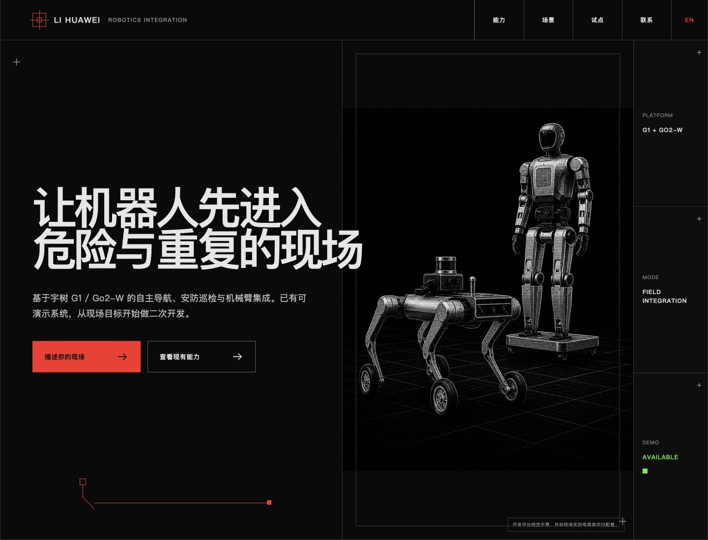

# 让机器人先进入危险与重复的现场

基于宇树 G1 / Go2-W 的自主导航、安防巡检与机械臂集成。已有安防场景自主导航 Demo，从一条真实路线、一个检查点、一次告警/回传闭环开始做二次开发。

> 独立机器人集成与二次开发服务，不代表宇树官方。具体能力以双方确认的硬件版本、配置和现场测试为准。



## 现在能做什么

- Go2-W / G1 现场二次开发与实机联调
- 安防与工业巡检自主导航 Demo
- 路线、检查点、到点事件、数据回传和人工接管闭环
- 相机、激光雷达、现场传感器与机械臂集成
- 为机器人厂商、总包或集成商提供软件与现场调试分包

## 最适合从什么开始

不先讨论“买一台机器人”，先确定一个可验收结果：

1. 选定一条真实路线和 1–3 个检查点。
2. 确认地面、坡度、网络、检查内容与异常定义。
3. 用现有 Demo 做适配与联调。
4. 在现场验证到点、采集、回传、告警或人工接管。

适用方向包括园区/厂区安防巡检、设备间与高风险区域信息采集、工业现场传感器上装，以及已有机器人项目的联合交付。

## 联系

把现场位置、路线视频/平面图、希望机器人完成的任务和回传方式发到：

**li.huawei@topsunpower.cc**

也可以填写结构化公开询盘：[创建项目询盘](https://github.com/lihuawei-topsun/robotics-field-integration/issues/new?template=project-inquiry.yml)。请勿在公开 Issue 中上传保密图纸、敏感厂区位置或私人账号信息。

网站部署地址：<https://lihuawei-topsun.github.io/robotics-field-integration/>

可下载转发：[G1 / Go2-W 机器人集成能力一页纸](https://lihuawei-topsun.github.io/robotics-field-integration/assets/unitree-g1-go2w-integration-one-pager.pdf)

## 项目资料

- [市场方向与成交切口](docs/market-direction.md)
- [公开需求与触达记录](docs/lead-log.md)
- [定向外联文案与 Demo 视频脚本](docs/outreach-pack.md)

## 本地运行网站

```bash
npm install
npm run dev
```

询盘表单不会暗中上传数据。访客填写后，页面在本地生成结构化邮件并打开默认邮件客户端，同时提供邮箱复制按钮。页面内机器人图片为 AI 生成的视觉示意，不是客户现场或宇树产品实拍。
